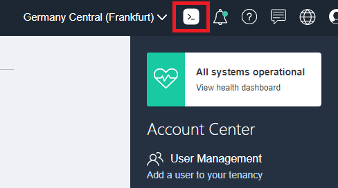
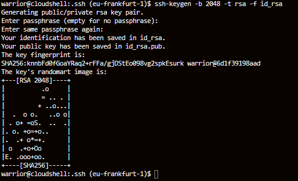
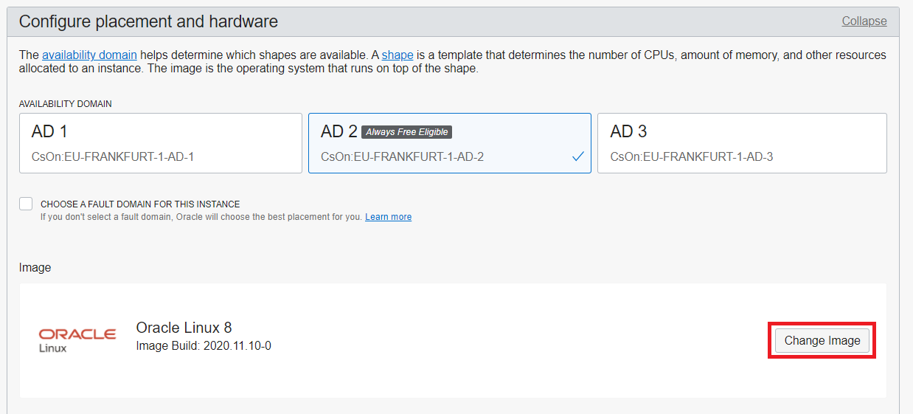
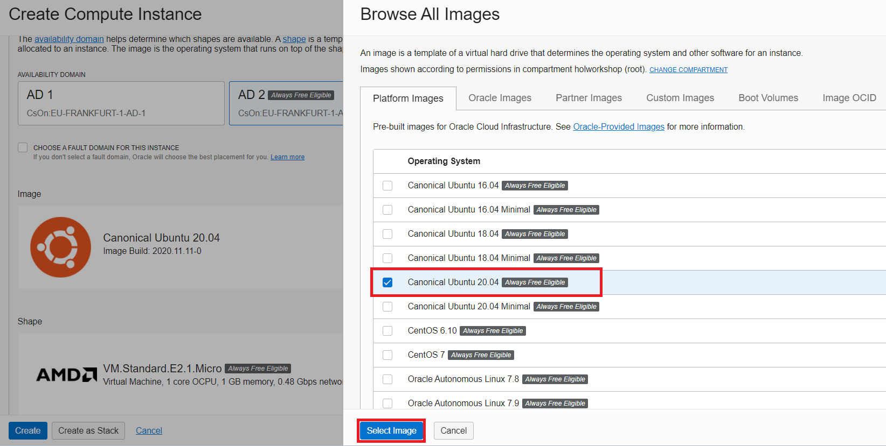
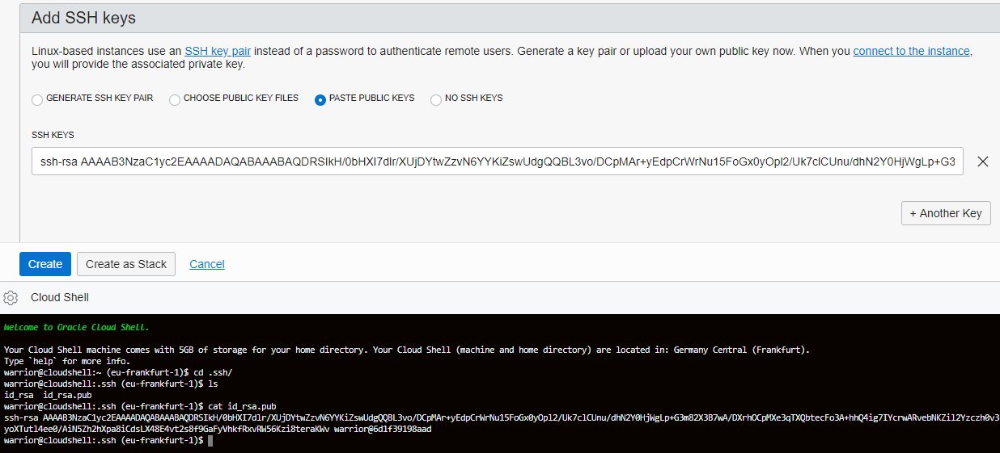
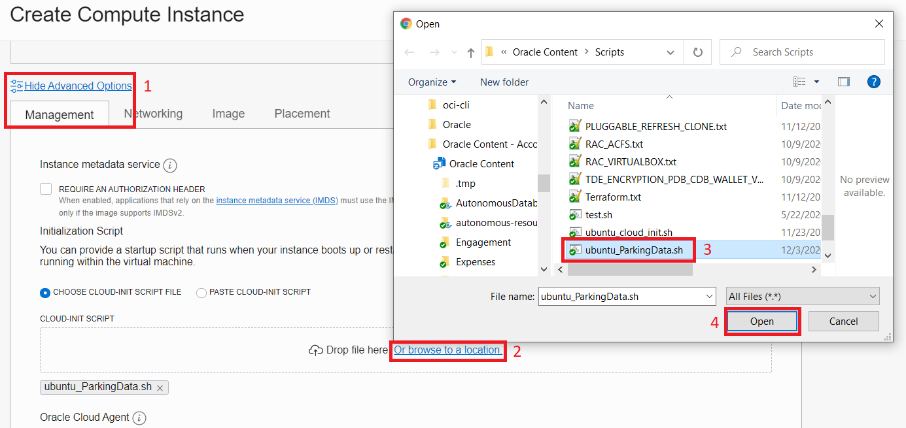
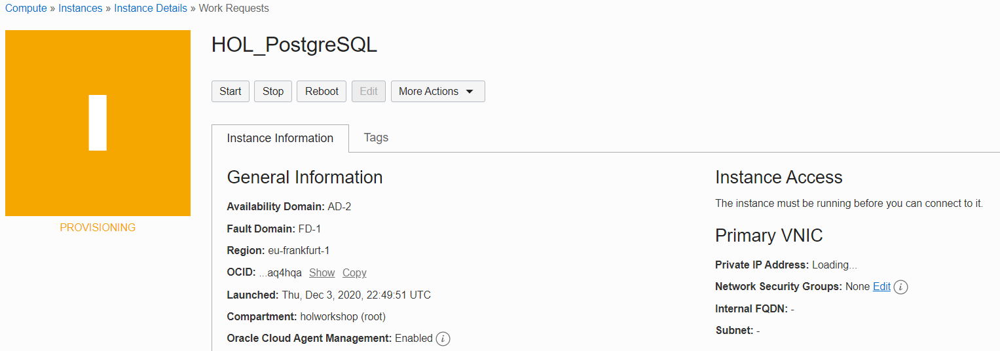
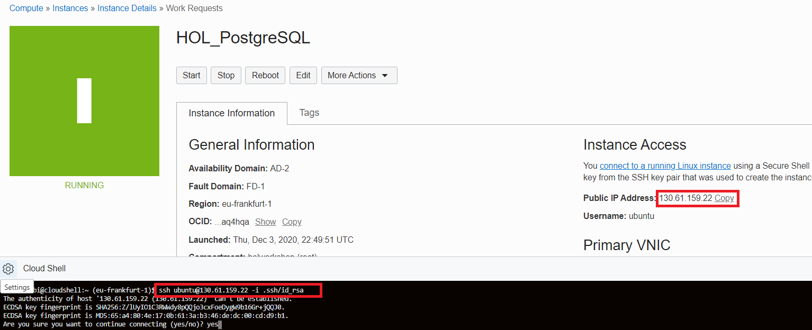

- [Go back to main](/README.md)
- [Go back to previous step](/gglab/step1.md)

# Lab 2
Oracle Cloud Infrastructure Compute lets you provision and manage compute hosts, known as instances. You can launch instances as needed to meet your compute and application requirements. After you launch an instance, you can access it securely from your computer, restart it, attach and detach volumes, and terminate it when you're done with it. Any changes made to the instance's local drives are lost when you terminate it. Any saved changes to volumes attached to the instance are retained.

## Step 1: Create SSH Keys Using Oracle Cloud Shell
The SSH (Secure Shell) protocol is a method for secure remote login from one computer to another. SSH enables secure system administration and file transfers over insecure networks using encryption to secure the connections between endpoints. SSH keys are an important part of securely accessing Oracle Cloud Infrastructure compute instances in the cloud.
The Cloud Shell machine is a small virtual machine running a Bash shell which you access through the OCI Console (Homepage). Cloud Shell comes with a pre-authenticated OCI CLI (Command Line Interface), set to the Console tenancy home page region, as well as up-to-date tools and utilities. To use the Cloud Shell machine, your tenancy administrator must grant the required IAM (Identity and Access Management) policy.

#### 1. To start the Oracle Cloud shell, go to your Cloud console and click the cloud shell icon at the top right of the page.



#### 2. Once the cloud shell has started, enter the following command. Identify your directory and create .ssh directory and go inside.


#### 3. Enter the following command to create your ssh private and public key files.
```
ssh-keygen -b 2048 -t rsa -f id_rsa
```

Choose the key name you can remember. I gave "id_rsa" and this will be the keyname I will use it later to connect to my compute instances. Press Enter twice for no passphrase.



Note in the output that there are two files, a private key: id_rsa and a public key: id_rsa.pub. Keep the private key safe and don't share its content with anyone. The public key will be needed for various activities and can be uploaded to certain systems as well as copied and pasted to facilitate secure communications in the cloud. Copy "id_rsa.pub" file


## Step 2. Create your PostgreSQLDB instance
Now let's create our PostgreSQL database in OCI compute service. Launching an instance is simple and intuitive with few options to select. The provisioning of the compute instance will complete in less than a minute and the instance state will change from provisioning to running.

#### 1. Navigate to the Compute tab and select Instances. 
Click Create Instance. Fill out the dialog box:
    **Name your instance**: Enter a name
    **Create in Compartment**: Choose the same compartment you used to create the VCN
    


#### 2. Choose AD 
Choose your AD, some may see only one AD depending on your region and click on "Change Image", we will choose Ubuntu...



#### 3. Change image 
Use latest available ubuntu version, for example 20 in our case.



#### 4. Change shape
Choose from available shapes for your tenancy. maybe more image needed here... will confirm


#### 5. Select VCN
Under Configure Networking, select your compartment then choose the VCN you created in Step 1. Notice ... more text needed here, Remember to choose public subnet and assign public IP address.


#### 6. Add SSH Keys previously created using CloudShell
Click on "Paste Public Keys", paste id_rsa.pub file content.



#### 8. Click to advanced options 
We are almost done here, but we haven't configured anything about PostgreSQL, so click on show advanced options and we will add cloud-init file.


#### 9. Upload cloud-init file
Choose cloud init script file and upload required file to install postgresql database. You can download it [here](./files/pgsql/ubuntu_cloud_init.sh). Download and save it as ubuntu_cloud_init.sh 



#### 10. Check
Review everything and click on "Create" button.


#### 11. Wait for Instance to be in Running state
Instance provisioning is very easy in OCI and it it will take around 1-2 minutes to create fully functional your linux instance. Once the instance state changes to Running, you can SSH to the Public IP address of the instance.



#### 12. Connect to your instance 

Open cloud shell and check your connection to your new PostgreSQL database you just created.

```
   ssh ubuntu@ip_address -i ~/.ssh/id_rsa
```
Enter 'yes' when prompted for security message, and enter your passphrase.


Ready.

- [Go back to next step](/gglab/step3.md)
